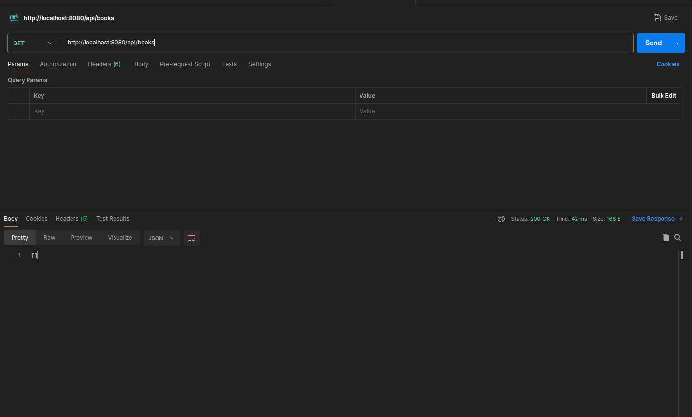
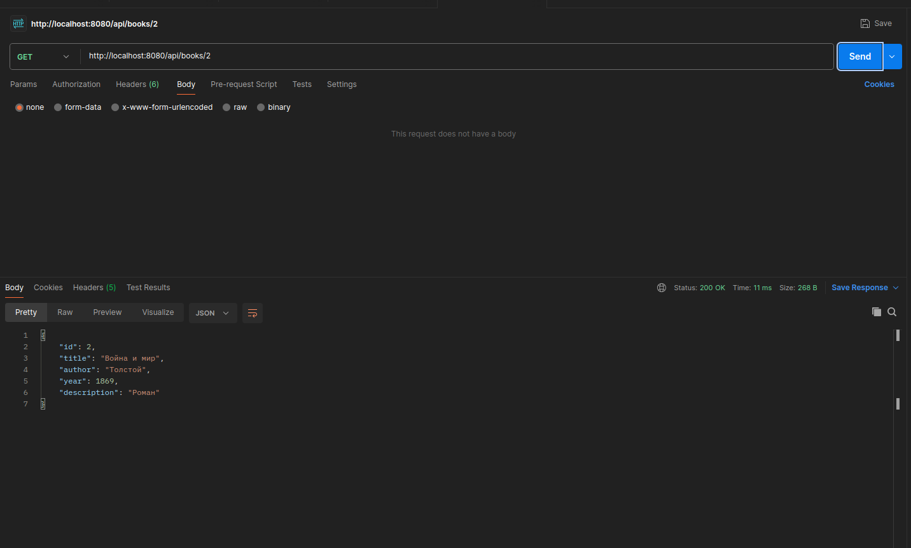
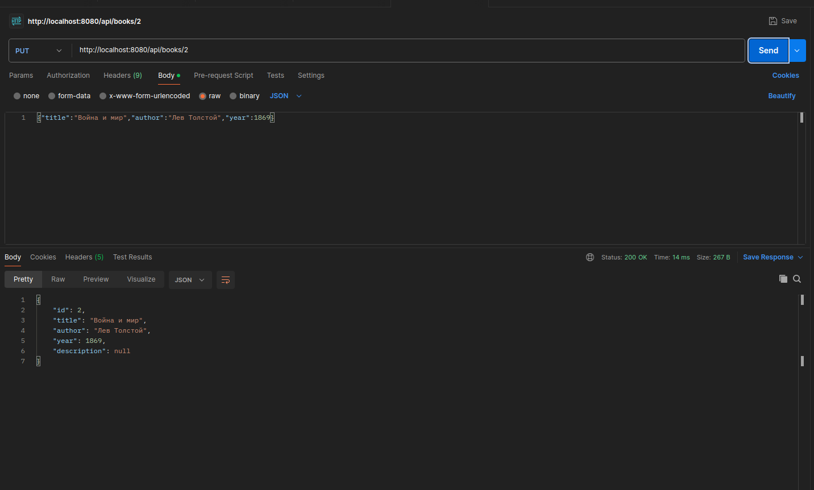
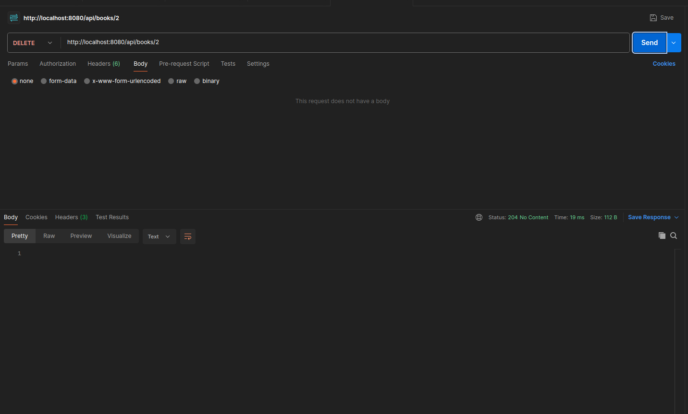

# Spring Boot Books API

Мини-бэкенд для управления книгами на Spring Boot. Реализован согласно техническому заданию с использованием архитектуры Entity → Repository → Service → Controller.

## Технологии

Spring Boot 3.5.7, Spring Web, Spring Data JPA, PostgreSQL. Никакой БД-логики в контроллере - все вынесено в сервисный слой.

## Архитектура

Код разнесен по слоям согласно требованиям:
- Entity - модель данных Book с JPA аннотациями
- Repository - интерфейс BookRepository наследует JpaRepository
- Service - бизнес-логика для всех CRUD операций
- Controller - REST API endpoints с правильными HTTP статусами

## API Endpoints

Все 5 маршрутов работают с корректными статусами:

GET /api/books - список всех книг (200)
GET /api/books/{id} - получить книгу по id (200/404)
POST /api/books - создать книгу (201/400)
PUT /api/books/{id} - обновить книгу (200/404/400)
DELETE /api/books/{id} - удалить книгу (204/404)

## Модель данных Book

id: Long (PK, авто-генерация)
title: String (обязательное)
author: String (обязательное)
year: Integer (необязательно)
description: String (необязательно)

## Запуск приложения

Установите PostgreSQL и создайте базу данных books_db. Настройте пользователя books_user с паролем books_password. Выдайте права доступа к таблице books и схеме public. Запустите через BooksApplication.java или командой ./mvnw spring-boot:run.

## Скриншоты работающих API

### 1. GET /api/books - список всех книг

### 2. POST /api/books - создание книги

### 3. GET /api/books/{id} - получение книги по ID

### 4. PUT /api/books/{id} - обновление книги

### 5. DELETE /api/books/{id} - удаление книги

Все endpoints протестированы через CURL. Приложение запускается успешно, все 5 маршрутов работают с корректными статусами.
